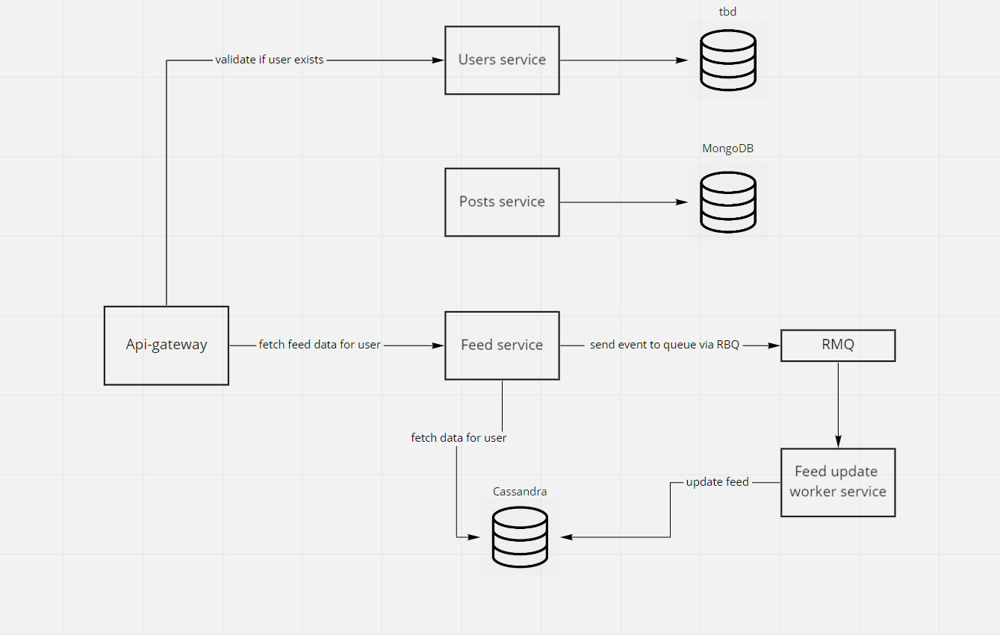

# Node task

### Early Concept


### Microservices
* api-gateway - gateway for request from outside world, handles request auth and communication between microservices
    * expose 80 port with `GET /feed`
    * communication with `users` and `feed` via RMQ-RPC
* users - should handle users related actions, in scope of this task the only action exposed by this service is fetching user by id for api-gateway authorization purposes
    * database mongo chosen due to ease of scaling and non-relation data, port is exposed to host due to development purposes (connecting with external database tools)
* feed - should handle fetching user feed (in scope of a task), in a current version it's also storing information about when user fetched the feed last time.
    * casandra is chosen because feed will be spammed with inserts and reads, it scales well and is prepared for heavy writes scenarios
    * casandra database with exposed port for development purposes, in real env should be only internal
* posts - should handle all posts related logic but in scope of node task it was not necessary to implement at all, because all posts data are pre-loaded inside `feed` service database as feed entries`
* feed-worker - not implement due to nature of task, it was not necessary to insert/update/delete posts (thus to create feed entries). If posts crud was required, then feed-worker must be implemented to handle communication and expensive upserts in cassandra.
  Then it can be implemented like this:
  1. Users add post via -> `POST /posts` in api gateway
  2. Gateway sends RMQ task to `posts` service
  3. Post service consumes event and fetch related users to the post (from post service by RMQ-RPC) and sends RMQ task to `feed`
  4. Feed service consumes event and create tasks for feed workers
  5. Feed worker upserts data into feed

### Docker Networks
* app-network - all services are inside external `app-network` provided by main docker-compose file (with RabbitMQ container), this allows communication with external docker-compose projects/services

### Known issues
- project is a monorepo solution, but does not use solution like lerna. In this simple case it was not necessary to use it, but in a large project I would like to have that, or git-submodule option.
- there are minor code duplications, like `RabbitMQModule`. In bigger project there should be something like `@shared` package or common repository with all common modules, interfaces, responses etc
- there are minor code quality inconsistencies issues regarding a configuration of queues
- e2e testing is lacking of test for creating new feed entry (command for that is already prepared, but is not connected)
- databases and rabbit are exposed for host for development purposes

### Known architecture problems/bottleneck
- I do not like the current implementation of `user-latest-feed-fetch` placed in `feed` service, it is a bottleneck, but I struggled to find a better place where it should be implemented.
  Now after implementation of this version, I think the correct way will be to store lastFetchAt datetime in User entity, and later on pass date to feed service (user data in already in api-gateway due to auth), 
  and feed service after sending fetching feed entries should create async task for user service to update lastFetchAt


### Run build environment and run e2e test
```
chmod -R +x scripts && ./scripts/down.sh && ./scripts/up.sh && ./scripts/seed.sh && ./scripts/e2e.sh
```

expected output

```
 PASS  test/app.e2e-spec.ts
  FeedController (e2e)
    ✓ /feed (GET) and should fail on auth (278 ms)
    ✓ /feed (GET) and get two feed entries (122 ms)
    ✓ /feed (GET) and get zero feed entries (104 ms)
```